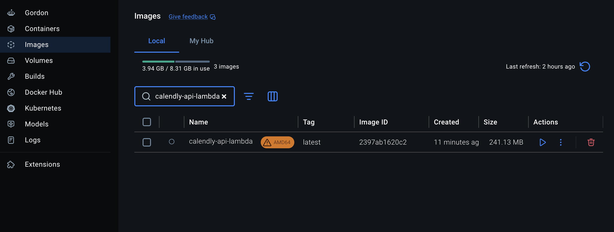
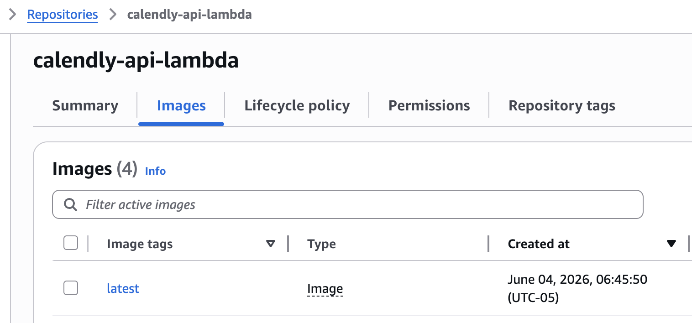
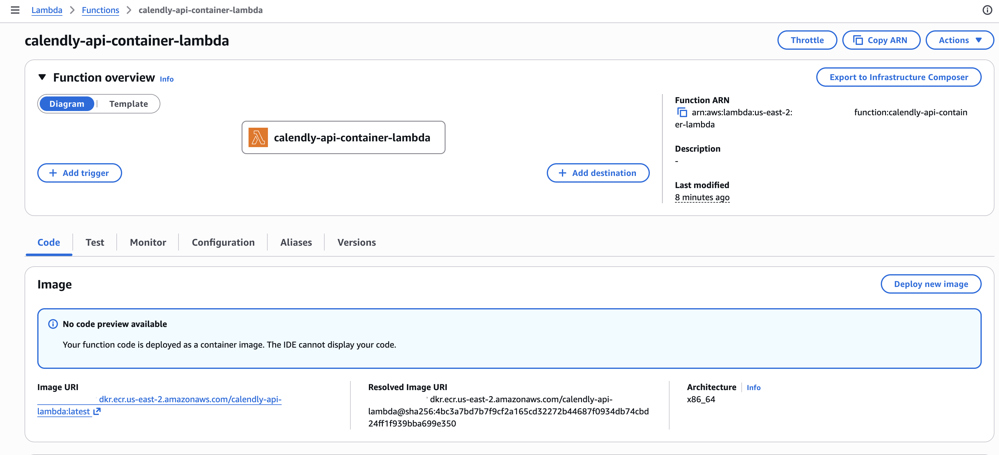
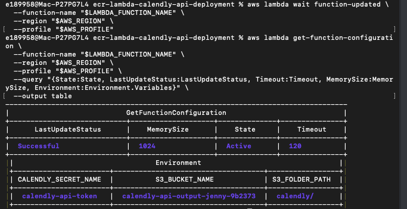
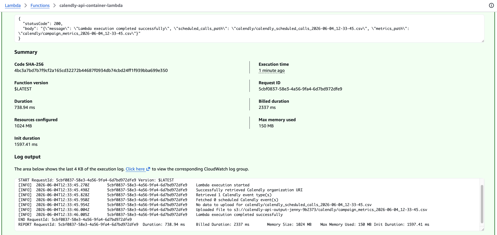
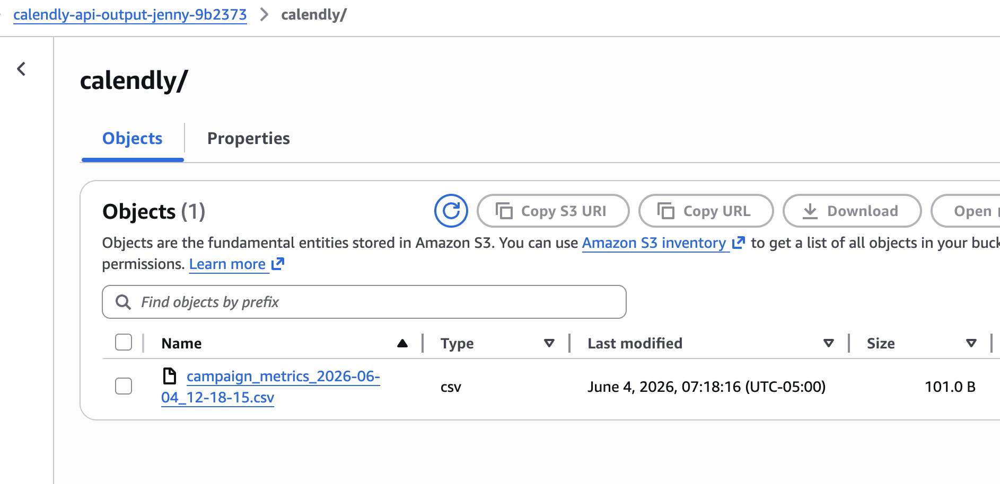
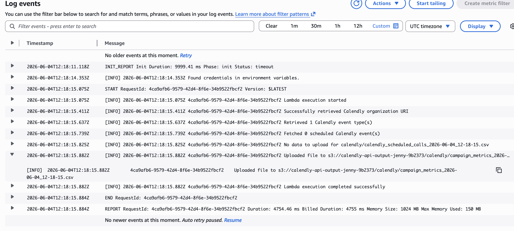

# ECR Lambda Calendly API Deployment

A containerized AWS Lambda project that calls the Calendly API, processes event data with Python, and writes CSV output to Amazon S3.

This project demonstrates a common cloud deployment pattern: package Python code and dependencies into a Docker image, push the image to Amazon ECR, and run the image as an AWS Lambda function.

## Project Overview

The project started with a Python script that calls the Calendly API. Instead of deploying the script as a standard Lambda zip package, the application was packaged as a Docker image.

That image was pushed to Amazon ECR. AWS Lambda then used the ECR image URI to run the containerized Python workflow.

The Lambda function retrieves the Calendly API token from AWS Secrets Manager, calls Calendly API endpoints, builds metrics with pandas, writes CSV output to S3, and logs execution details in CloudWatch.

## Architecture

```text
Calendly API
    ↓
AWS Lambda container function
    ↓
AWS Secrets Manager
    ↓
Python requests + pandas processing
    ↓
Amazon S3 CSV output
    ↓
Amazon CloudWatch Logs
```

## What This Project Demonstrates

- Calling an external API from Python
- Using Bearer token authentication without hardcoding the token
- Storing the API token in AWS Secrets Manager
- Packaging Python code and dependencies with Docker
- Building a Lambda-compatible container image
- Pushing a Docker image to Amazon ECR
- Creating an AWS Lambda function from an ECR image URI
- Configuring Lambda environment variables
- Writing processed CSV output to Amazon S3
- Validating runtime behavior through CloudWatch Logs
- Cleaning up AWS resources after validation

## Services and Tools Used

| Service / Tool | Purpose |
|---|---|
| Python | Main application logic |
| requests | Calls the Calendly API |
| pandas | Creates tabular CSV output and metrics |
| Docker Desktop | Builds the local container image |
| Amazon ECR | Stores the Docker image used by Lambda |
| AWS Lambda | Runs the containerized API workflow |
| AWS Secrets Manager | Stores the Calendly API token securely |
| Amazon S3 | Stores generated CSV output |
| IAM | Grants Lambda access to Secrets Manager, S3, and CloudWatch |
| CloudWatch Logs | Captures Lambda execution logs |
| AWS CLI | Creates, deploys, validates, and cleans up AWS resources |
| VS Code | Local project editing and file organization |

## Repository Structure

```text
.
├── Dockerfile
├── lambda_function.py
├── requirements.txt
├── commands-project.sh
├── docs/
├── learning-notes/
├── screenshots/
│   ├── full-walkthrough/
│   └── selected-for-readme/
└── notes/
    └── private/
```

## Application Flow

1. Lambda starts from a container image stored in Amazon ECR.
2. The function reads environment variables for:
   - S3 bucket name
   - S3 folder path
   - Secrets Manager secret name
3. Lambda retrieves the Calendly API token from AWS Secrets Manager.
4. The function calls the Calendly `/users/me` endpoint to identify the current Calendly organization.
5. It retrieves event types for that organization.
6. It checks for scheduled events for those event types.
7. It creates metrics for scheduled calls and completed calls.
8. It uploads CSV output to Amazon S3.
9. CloudWatch Logs capture the major execution steps.

## Key Files

| File | Description |
|---|---|
| `lambda_function.py` | Main Lambda handler and Calendly API workflow |
| `Dockerfile` | Builds the Lambda-compatible container image |
| `requirements.txt` | Python dependencies installed in the image |
| `commands-project.sh` | Project-specific AWS CLI and Docker command reference |

## Lambda Environment Variables

| Variable | Purpose |
|---|---|
| `S3_BUCKET_NAME` | Target S3 bucket for CSV output |
| `S3_FOLDER_PATH` | S3 prefix used for output files |
| `CALENDLY_SECRET_NAME` | Secrets Manager secret containing the Calendly API token |

The Calendly token is not stored directly in the application code or Lambda environment variables. Lambda uses the secret name to retrieve the token from AWS Secrets Manager at runtime.

## Output

The Lambda function writes CSV files under the configured S3 folder path.

Example output path:

```text
s3://calendly-api-output-jenny-9b2373/calendly/campaign_metrics_2026-06-04_12-18-15.csv
```

During testing, the personal Calendly account had no scheduled events available through the API. Because of that, the scheduled-calls DataFrame was empty and the function skipped that upload. The metrics CSV was still created and uploaded successfully.

Example metrics output:

```csv
timestamp,total_scheduled_calls,completed_calls,completed_calls_percentage
2026-06-04_12-18-15,0,0,0
```

## Validation Evidence

| Screenshot | What It Shows |
|---|---|
| `02-s3-output-bucket-created.png` | S3 output bucket created for generated CSV files |
| `03-secrets-manager-calendly-secret-created.png` | Calendly API token stored in Secrets Manager without exposing the value |
| `04-lambda-iam-role-created.png` | Lambda execution role with CloudWatch, S3, and Secrets Manager permissions |
| `06-docker-build-success.png` | Docker image built locally for Lambda deployment |
| `07-ecr-image-pushed.png` | Container image pushed to Amazon ECR |
| `08-lambda-created-from-ecr-image.png` | Lambda function created from the ECR image URI |
| `09-lambda-environment-variables-configured.png` | Lambda environment variables configured |
| `10-lambda-test-success.png` | Lambda test completed successfully with status code 200 |
| `11-s3-output-files-created.png` | CSV output created in S3 |
| `12-s3-metrics-csv-preview.png` | Metrics CSV preview from S3 |
| `13-cloudwatch-logs-success.png` | CloudWatch logs showing successful execution |
| `14-cleanup-confirmation.png` | AWS resources removed after validation |

## Selected Screenshots

### Docker Image Built Locally



### Image Pushed to Amazon ECR



### Lambda Created from ECR Image



### Lambda Environment Variables



### Lambda Test Success



### S3 Output Created



### CloudWatch Logs



## Docker and Lambda Architecture Note

The image was built for `linux/amd64` because the Lambda function was configured for `x86_64` architecture.

On an Apple Silicon Mac, Docker Desktop may show an AMD64 warning for the local image because local execution may use emulation. That warning does not prevent the image from being pushed to ECR or used by a Lambda function configured for `x86_64`.

## Troubleshooting Note

During the first Lambda create attempt, AWS Lambda rejected the ECR image with this error:

```text
The image manifest, config or layer media type for the source image is not supported.
```

The fix was to rebuild the image with Docker Buildx using Lambda-compatible image settings:

```bash
docker buildx build \
  --platform linux/amd64 \
  --provenance=false \
  --sbom=false \
  --load \
  -t calendly-api-lambda:latest \
  .
```

After rebuilding locally, the image was tagged and pushed to ECR again. Lambda was then able to create the function from the ECR image URI.

## Cleanup

After validation, project resources were deleted to avoid unnecessary AWS costs.

Resources removed:

- Lambda function
- ECR repository and image
- S3 output bucket and generated CSV files
- Secrets Manager secret
- Lambda IAM role and inline policy
- CloudWatch log group

## Final Result

The project successfully deployed a Python Calendly API workflow as a Lambda container image.

The function retrieved its API token from Secrets Manager, ran from an ECR-hosted Docker image, generated a metrics CSV, uploaded the result to S3, and logged the execution in CloudWatch.
